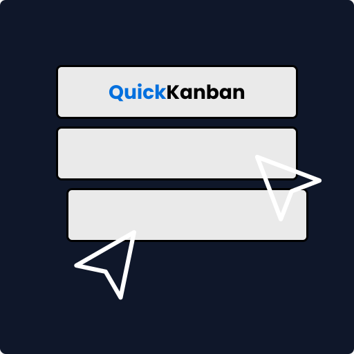

# 👨‍💻👩‍💻 QuickKanban

<div align="center">
  
</div>

**QuickKanban** is a real-time, collaborative kanban board built for efficient project planning and team coordination.

🌐 **Live Demo:** [https://quickkanban.xyz](https://quickkanban.xyz)

---

## 🚀 Tech Stack

[](https://socket.io/)
[](https://reactjs.org/)
[](https://expressjs.com/)
[](https://www.mongodb.com/)
[](https://redis.io/)
[](https://nodejs.org/)
[](https://chakra-ui.com/)
[](https://www.docker.com/)
[](https://aws.amazon.com/ecs/)
[](https://aws.amazon.com/ec2/)
[](https://aws.amazon.com/ecr/)

**Frontend:** React, Chakra UI, Socket.IO Client  
**Backend:** Node.js, Express, Socket.IO Server, Redis  
**Database:** MongoDB, Mongoose, Redis (cache)  
**Deployment:** Docker, AWS ECS (EC2), ECR, Nginx

## ✨ Features

- ⚡ **Real-time updates** using WebSockets (Socket.IO)
- 👥 **Live user presence tracking** in collaborative kanban rooms
- 🧠 **In-memory caching** with Redis for low-latency API responses
- 🖱️ **Live cursor indicators** to show teammates' movements in real-time
- 📌 Add tasks fluidly in board; drag-and-drop tasks with dynamic column transitions
- 💾 Persistent task storage with MongoDB

## 🖥️ System Architecture

- **Frontend**: Runs React client with live collaboration UI
- **Backend**: Runs the server side logic using Express.js and Socket.IO
- **Redis**: Used for caching frequent reads and providing quick data responses
- **MongoDB**: Stores persistent storage for data durability

## ⚙️ Setup & Deployment

QuickKanban's backend is fully containerized and deployed using AWS infrastructure. Here’s a high-level overview:

### 🐳 Containerization

- Each service (backend, Redis, Nginx) is a separate Docker container.
- Managed using a multi-container ECS task definition.

### ☁️ AWS Deployment

- **Amazon ECS (EC2 Launch Type):** Manages task and service orchestration.
- **Amazon EC2:** Hosts all running containers and mounts SSL certificates.
- **Amazon ECR:** Stores Docker images for backend and Nginx containers.
- **Nginx:** Serves HTTPS traffic and proxies requests to backend.

📁 Deployment files:

- `ecs-task-definition.json`
- `nginx.conf`
- `Dockerfile` two for both backend and Nginx

## 🤝 Contributing

Please feel free to contribute! This is a really exciting project that can be used almost anywhere.

### 🛠️ Local Development Setup

1. **Fork** this repository
2. Clone your fork:

```bash
 git clone https://github.com/mhit30/quickkanban.git
```

Note: Make sure MongoDB and Redis are running on your system.

```bash
 cd backend && npm install
```

```bash
 cd frontend && npm install
```

For backend (with Nodemon):

```bash
  nodemon index.js
```

For frontend (with React Vite)

```bash
  npm run dev
```

### 🔄 Making PRs

- Use **feature branches**:  
  `git checkout -b feature/your-feature-name`

- Keep pull requests **scoped and descriptive**:
  - What feature or fix you made
  - Why its helpful

## 📄 License

This project is licensed under the [MIT License](./LICENSE).  
You're free to use, modify, and distribute this software with proper attribution.
